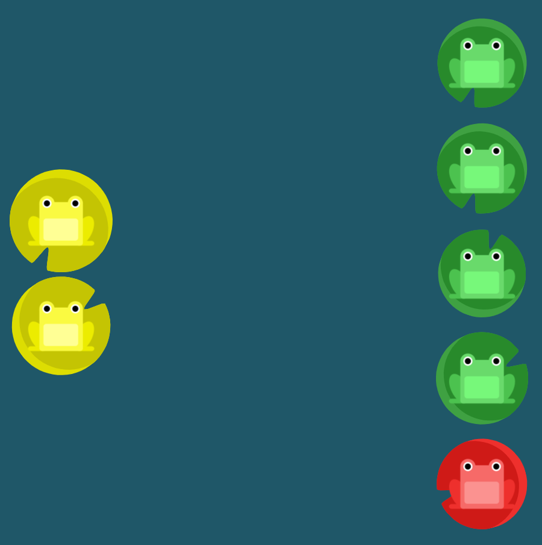

# Flexbox Froggy Extra Credit

If you complete level 24 of [Flexbox Froggy](https://flexboxfroggy.com/), then it's time for some extra credit!

## Instructions

#### Part 1

Starting from scratch, create an `index.html` file and a `styles.css` file that recreates the final level (level 24) of Flexbox Froggy. 

Initially, recreate the level without the lily pads (to avoid having to figure out how to put one HTML element on top of another).

You can find the URLs for the images below:

* https://flexboxfroggy.com/images/frog-green.svg
* https://flexboxfroggy.com/images/frog-yellow.svg
* https://flexboxfroggy.com/images/frog-red.svg

#### Part 2

Now add in the lily pads. The trick here is going to be figuring out how to stack HTML elements on top of one another. Try Googling this and using examples on Stack Overflow to figure this out. If need be, feel free to reach out to Alex or Mesi for hints as well.

* https://flexboxfroggy.com/images/lilypad-green.svg
* https://flexboxfroggy.com/images/lilypad-yellow.svg 
* https://flexboxfroggy.com/images/lilypad-red.svg 
